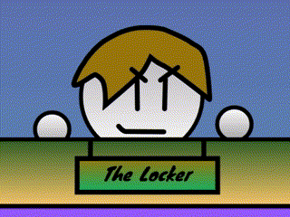

# Tactigun! Assets
🎨🎵🧑‍💻 Basically a bunch of music, spritework, old builds, hence the name Tactigun assets.

If you want the repository locally, you can use [git](https://git-scm.com/downloads) to clone it with:

🛠️ `git clone https://github.com/TobHop/tactigun-assets.git`

You can update the repository by doing:

🛠️ `git pull https://github.com/TobHop/tactigun-assets.git`
(Make sure you have initilized git with `git init`)

# How to compile SB3 to HTML/WINDOWS/MAC/LINUX?

1. First you will need the scratch 3 (.sb3) file of the Tactigun engine I or II game or modified Tactigun version you want to compile to html. (I have some Tactigun builds you can use in the builds folder.)

2. Go to the [Turbowarp Packager site](https://packager.turbowarp.org/) choose file, and upload the .sb3

3. Scroll to the bottom of the page and click "Import Settings"

4. Download the main Tactigun settings i have provided at `Coding/Turbowarp stuff/tactigunmainpackagersettings.json`

5. Upload the settings

5.5 **(OPTIONAL)**. Play around with the settings to your liking. These are just my recommended settings.

6. Choose your platform to build to.

7. You can now test the build by previewing it, or downloading it.

# You are done! Enjoy your custom Tactigun engine I or II based game or modified Tactigun version!

Note: TobHopU does not officially support builds for proprietary platforms

❌ Windows/Mac/Linux
✅ HTML/Scratch
